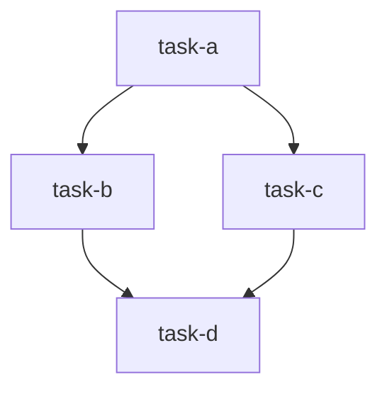
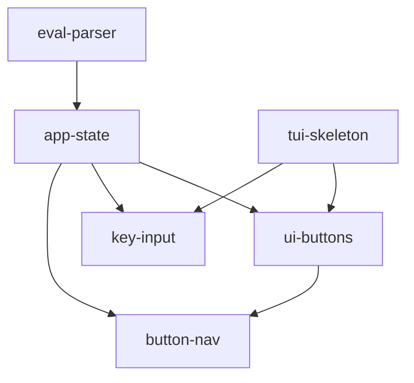

# TASKS.md format

`docs/TASKS.md` is the index for the whole plan. It has three sections in this
order: **Design**, **Dependencies**, **Tasks**. Below is the structure, then a
filled example.

## Structure

```markdown
# <Project> — Tasks

<One sentence on what this file is. If a fuller design doc exists, link it:
"See [design.md](design.md) for full context.">

> **Progress log:** [progress.md](progress.md) records *how* each task is carried
> out — what was done, decisions made, what works, what doesn't. **Read it before
> starting a task**, and keep your task's section updated as you work, so the next
> task can build on what you learned.

## Design

<A concise high-level design — enough that someone can pick up the project
without re-deriving intent. Cover, briefly:
- Overview: what it is and the core value.
- Architecture / main components and their responsibilities.
- Key technical choices and why (stack, libraries, data model).
Keep it tight. When this section gets long (rough rule: more than a screen or
two), move the detail into docs/design.md and leave a short summary + link here.>

## Dependencies

<Canonical source of truth for the dependency graph. The "what's next" query
reads this. Keep the Mermaid diagram and the list in agreement.>



Dependency list (a task is executable when all its deps are `[x]` done):

- `task-a`: (none)
- `task-b`: `task-a`
- `task-c`: `task-a`
- `task-d`: `task-b`, `task-c`

## Tasks

**Legend:** `[ ]` not started · `[~]` in progress · `[x]` done

- [ ] [Task A title](tasks/task-a.md)
- [ ] [Task B title](tasks/task-b.md)
- [ ] [Task C title](tasks/task-c.md)
- [ ] [Task D title](tasks/task-d.md)
```

## Grouping into phases (optional)

When the build has a natural order or each stage delivers something usable on its
own, group the task list into phases/stories. Use a short goal line per phase:

```markdown
## Tasks

**Legend:** `[ ]` not started · `[~]` in progress · `[x]` done

### Phase 1: Basic viewer
> Goal: a usable standalone viewer with the core rendering path working.

- [x] [Repo detection](tasks/repo-detection.md)
- [ ] [Diff computation](tasks/diff-computation.md)

### Phase 2: Review workflow
> Goal: comments and persistence — the workflow works end to end.

- [ ] [Comment CRUD](tasks/comment-crud.md)
```

Phases are just headings over the same checklist; the Dependencies section still
covers every task regardless of phase.

## Conventions

- **Task names are kebab-case** and match the file stem: `tasks/diff-computation.md`
  ↔ `diff-computation` in the dependency list. This is what makes the two
  sections cross-referenceable.
- In the dependency list, wrap task names in backticks and write `(none)` for
  tasks with no dependencies — explicit beats blank.
- The Mermaid `graph TD` (top-down) reads well for build order; `graph LR` is
  fine for wide, shallow graphs. Edges point **from dependency to dependent**
  (`task-a --> task-b` means "b depends on a").
- Keep the three sections' edges in sync. The dependency list is canonical; the
  diagram visualizes it; per-task files mirror it.
- The **Progress log** blockquote near the top points agents at `progress.md` (the
  execution log) and tells them to read it before starting and update it as they
  work. `/tasks-setup` seeds `progress.md` alongside this file. See
  `progress-md-format.md`.

## Worked example

```markdown
# Calc — Tasks

A TUI calculator. See [design.md](design.md) if the design section grows.

> **Progress log:** [progress.md](progress.md) records *how* each task is carried
> out. Read it before starting a task, and keep your task's section updated as you
> work.

## Design

### Overview
A keyboard- and mouse-driven TUI calculator that evaluates arithmetic
expressions, inspired by the macOS Calculator.

### Architecture
- `eval` — recursive-descent parser/evaluator. Pure logic, no UI.
- `app` — application state machine (expression, result, focused button).
- `ui` — renders the display and the button grid.
- `main` — terminal setup and the event loop.

### Key choices
- Rust + Ratatui/crossterm for a single fast binary.
- Evaluator returns `Result<f64, String>` so errors render in the display.

## Dependencies



Dependency list (a task is executable when all its deps are `[x]` done):

- `eval-parser`: (none)
- `tui-skeleton`: (none)
- `app-state`: `eval-parser`
- `ui-buttons`: `app-state`, `tui-skeleton`
- `key-input`: `app-state`, `tui-skeleton`
- `button-nav`: `app-state`, `ui-buttons`

## Tasks

**Legend:** `[ ]` not started · `[~]` in progress · `[x]` done

- [x] [Expression parser and evaluator](tasks/eval-parser.md)
- [x] [Terminal setup and event loop](tasks/tui-skeleton.md)
- [x] [Application state and core logic](tasks/app-state.md)
- [ ] [Render button grid with focus](tasks/ui-buttons.md)
- [ ] [Direct keyboard input](tasks/key-input.md)
- [ ] [Button navigation with HJKL/arrows](tasks/button-nav.md)
```
