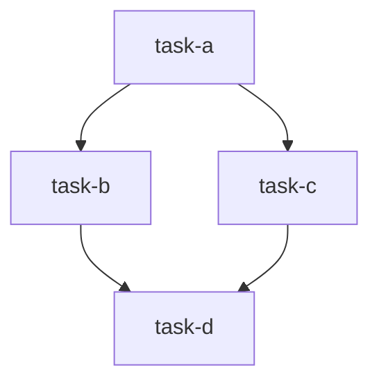
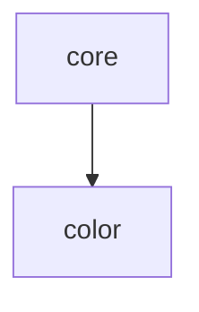
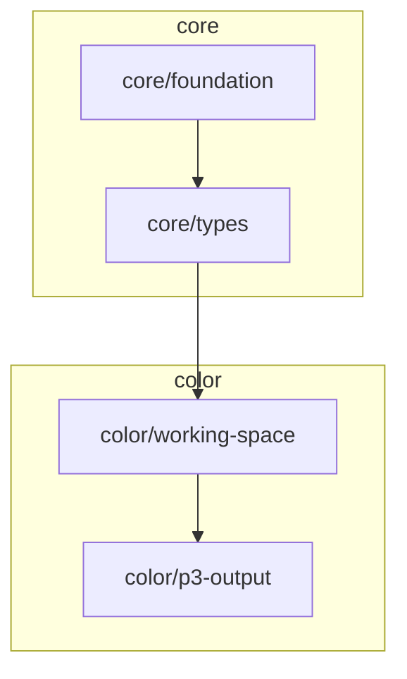
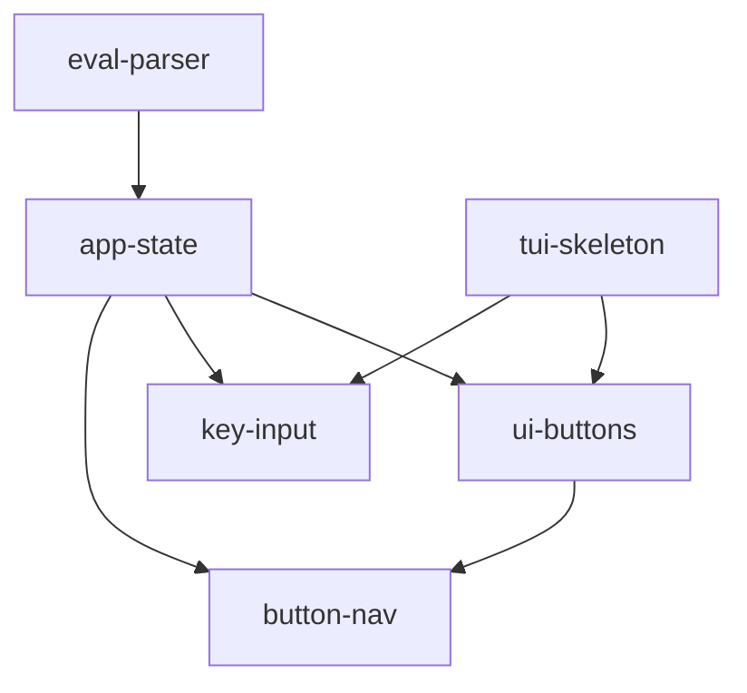
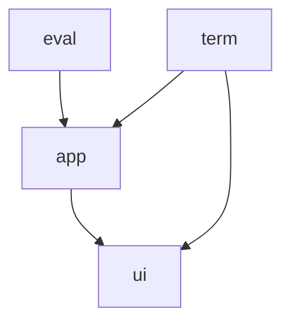
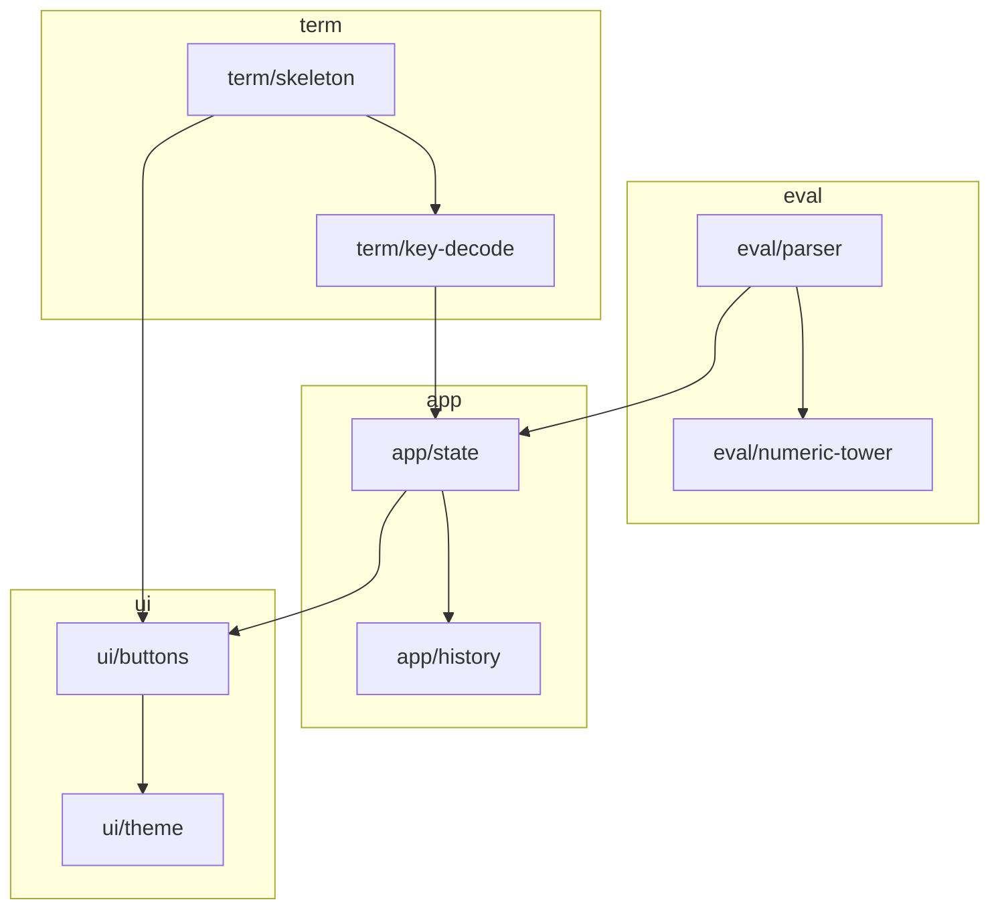

# TASKS.md format

`docs/TASKS.md` is the index for the whole plan. It has three sections in this
order: **Design**, **Dependencies**, **Tasks**. Below is the structure for a flat
plan, then the epic-mode variant, then a filled example of each.

`TASKS.md` stays a **single file** in both modes. It is the control center; only
the task files and the progress log shard by epic.

## Structure (flat mode)

````markdown
# <Project> — Tasks

<One sentence on what this file is. If a fuller design doc exists, link it:
"See [design.md](design.md) for full context.">

> **Progress log:** [progress.md](progress.md) records *how* each task is carried
> out — what was done, decisions made, what works, what doesn't. **Read it before
> starting a task**, and keep your task's section updated as you work, so the next
> task can build on what you learned.

## Design

<A concise high-level design — enough that someone can pick up the project
without re-deriving intent. Cover, briefly:
- Overview: what it is and the core value.
- Architecture / main components and their responsibilities.
- Key technical choices and why (stack, libraries, data model).
Keep it tight. When this section gets long (rough rule: more than a screen or
two), move the detail into docs/design.md and leave a short summary + link here.>

## Dependencies

<Canonical source of truth for the dependency graph. The "what's next" query
reads this. Keep the Mermaid diagram and the list in agreement.>



Dependency list (a task is executable when all its deps are `[x]` done):

- `task-a`: (none)
- `task-b`: `task-a`
- `task-c`: `task-a`
- `task-d`: `task-b`, `task-c`

## Tasks

**Legend:** `[ ]` not started · `[~]` in progress · `[x]` done

- [ ] [Task A title](tasks/task-a.md)
- [ ] [Task B title](tasks/task-b.md)
- [ ] [Task C title](tasks/task-c.md)
- [ ] [Task D title](tasks/task-d.md)
````

## Structure (epic mode)

Used once the plan outgrows a flat list — see `epics.md`, which is authoritative
on the threshold and the grouping rules. Four things change:

1. Task ids become **`<epic>/<task>`**, matching `tasks/<epic>/<task>.md`.
2. The Mermaid diagram wraps each epic's nodes in a `subgraph`.
3. A derived **epic rollup** diagram is added above the task-level one.
4. The task list is grouped under `###` epic headings, each with a scope line and
   a link to that epic's progress file.

````markdown
# <Project> — Tasks

<One sentence on what this file is, plus a link to design.md if it exists.>

> **Progress log:** one file per epic under [progress/](progress/) records *how*
> each task is carried out. **Before starting a task, read your epic's progress
> file in full, plus the `Epic summary` section of every epic you depend on** —
> then keep your own task's section updated as you work.

## Design

<Same as flat mode. In epic mode this section carries extra weight: the
Architecture bullets should line up with the epic list below, since epics are
structural. If they've drifted apart, one of the two is wrong.>

## Dependencies

<Canonical source of truth for the dependency graph, at the **task** level. The
"what's next" query reads the dependency list. Keep the diagram and the list in
agreement.>

Epic rollup (derived from the task graph — do not author epic-level edges here;
regenerate this whenever the task edges change):





Dependency list (a task is executable when all its deps are `[x]` done):

- `core/foundation`: (none)
- `core/types`: `core/foundation`
- `color/working-space`: `core/types`
- `color/p3-output`: `color/working-space`

## Tasks

**Legend:** `[ ]` not started · `[~]` in progress · `[x]` done
**Epic status** is derived from its tasks — don't record it separately.

### core — [progress](progress/core.md)
> Project skeleton and the types every other epic depends on.

- [x] [Project foundation](tasks/core/foundation.md)
- [ ] [Shared image types](tasks/core/types.md)

### color — [progress](progress/color.md)
> Working-space definition and colour-managed output encoding.

- [ ] [Working-space mapping](tasks/color/working-space.md)
- [ ] [Display P3 output](tasks/color/p3-output.md)
````

## Conventions

- **Flat-mode task names are kebab-case** and match the file stem:
  `tasks/diff-computation.md` ↔ `diff-computation`.
- **Epic-mode task ids are `<epic>/<task>`** and match the path stem:
  `tasks/color/p3-output.md` ↔ `color/p3-output`. This is what makes the
  dependency list, the task list, the task files, and the progress files
  cross-referenceable.
- Mermaid's flowchart parser accepts `/` in bare node ids, so slash ids need no
  quoting. **Never** introduce alias ids like `color_p3_output` — a second naming
  scheme is a second thing to keep in sync.
- In the dependency list, wrap task ids in backticks and write `(none)` for tasks
  with no dependencies — explicit beats blank.
- The Mermaid `graph TD` (top-down) reads well for build order; `graph LR` is
  fine for wide, shallow graphs. Edges point **from dependency to dependent**
  (`task-a --> task-b` means "b depends on a").
- **The task-level dependency list is canonical.** The task-level diagram
  visualizes it, the epic rollup summarizes it, and per-task files mirror it.
  When any of them disagree, the list wins.
- **The epic rollup is derived, never authored.** An edge `core --> color` means
  "some task in `color` depends on some task in `core`". Build it by projecting
  every cross-epic task edge onto its epics, then dropping intra-epic edges and
  duplicates. Don't add epic edges that no task edge backs, and don't use the
  rollup to answer "what's next" — it is coarser than the real graph and would
  report false blocks.
- **A cycle in the rollup is not a defect.** An acyclic task graph can project to
  a cyclic rollup (`core/types → ui/buttons` with `ui/theme → core/palette`). Only
  the task graph must be acyclic; never adjust task edges to tidy the rollup.
- **Epic status is derived too**: no tasks started → not started; all `[x]` →
  done; otherwise in progress. Don't store it, or it will go stale.
- **No phase/stage grouping.** Group tasks by structure (epics) only. Delivery
  stages cut across subsystems and make incoherent groups; see `epics.md`.
- The **Progress log** blockquote near the top tells agents which progress files
  to read before starting and to update their own as they work. The setup
  operation seeds the progress file(s) alongside this one. See
  `progress-md-format.md`.

## Worked example (flat mode)

````markdown
# Calc — Tasks

A TUI calculator. See [design.md](design.md) if the design section grows.

> **Progress log:** [progress.md](progress.md) records *how* each task is carried
> out. Read it before starting a task, and keep your task's section updated as you
> work.

## Design

### Overview
A keyboard- and mouse-driven TUI calculator that evaluates arithmetic
expressions, inspired by the macOS Calculator.

### Architecture
- `eval` — recursive-descent parser/evaluator. Pure logic, no UI.
- `app` — application state machine (expression, result, focused button).
- `ui` — renders the display and the button grid.
- `main` — terminal setup and the event loop.

### Key choices
- Rust + Ratatui/crossterm for a single fast binary.
- Evaluator returns `Result<f64, String>` so errors render in the display.

## Dependencies



Dependency list (a task is executable when all its deps are `[x]` done):

- `eval-parser`: (none)
- `tui-skeleton`: (none)
- `app-state`: `eval-parser`
- `ui-buttons`: `app-state`, `tui-skeleton`
- `key-input`: `app-state`, `tui-skeleton`
- `button-nav`: `app-state`, `ui-buttons`

## Tasks

**Legend:** `[ ]` not started · `[~]` in progress · `[x]` done

- [x] [Expression parser and evaluator](tasks/eval-parser.md)
- [x] [Terminal setup and event loop](tasks/tui-skeleton.md)
- [x] [Application state and core logic](tasks/app-state.md)
- [ ] [Render button grid with focus](tasks/ui-buttons.md)
- [ ] [Direct keyboard input](tasks/key-input.md)
- [ ] [Button navigation with HJKL/arrows](tasks/button-nav.md)
````

## Worked example (epic mode)

The same calculator, grown past the threshold. Note the epics are `eval`, `app`,
`ui`, `term` — parts of the system — and *not* "core features" / "polish", which
would be delivery stages.

````markdown
# Calc — Tasks

A TUI calculator. See [design.md](design.md) for the full design.

> **Progress log:** one file per epic under [progress/](progress/) records *how*
> each task is carried out. Before starting a task, read your epic's progress file
> in full, plus the `Epic summary` of every epic you depend on; keep your own
> task's section updated as you work.

## Design

### Overview
A keyboard- and mouse-driven TUI calculator that evaluates arithmetic
expressions, inspired by the macOS Calculator.

### Architecture
- `eval` — parser/evaluator and the numeric tower. Pure logic, no UI.
- `app` — application state machine, history, and the command layer.
- `ui` — display, button grid, theming, and layout.
- `term` — terminal setup, the event loop, and input decoding.

### Key choices
- Rust + Ratatui/crossterm for a single fast binary.
- Evaluator returns `Result<Value, EvalError>`; the UI renders the message.

## Dependencies

Epic rollup (derived from the task graph):





Dependency list (a task is executable when all its deps are `[x]` done):

- `eval/parser`: (none)
- `eval/numeric-tower`: `eval/parser`
- `term/skeleton`: (none)
- `term/key-decode`: `term/skeleton`
- `app/state`: `eval/parser`, `term/key-decode`
- `app/history`: `app/state`
- `ui/buttons`: `app/state`, `term/skeleton`
- `ui/theme`: `ui/buttons`

## Tasks

**Legend:** `[ ]` not started · `[~]` in progress · `[x]` done
**Epic status** is derived from its tasks — don't record it separately.

### eval — [progress](progress/eval.md)
> Expression evaluation: parsing, precedence, and the numeric representation.

- [x] [Expression parser](tasks/eval/parser.md)
- [ ] [Numeric tower and precision](tasks/eval/numeric-tower.md)

### term — [progress](progress/term.md)
> Terminal lifecycle and raw input decoding.

- [x] [Terminal setup and event loop](tasks/term/skeleton.md)
- [ ] [Key decoding and chords](tasks/term/key-decode.md)

### app — [progress](progress/app.md)
> Application state machine and the commands that drive it.

- [ ] [Application state and core logic](tasks/app/state.md)
- [ ] [Expression history](tasks/app/history.md)

### ui — [progress](progress/ui.md)
> Everything drawn on screen.

- [ ] [Render button grid with focus](tasks/ui/buttons.md)
- [ ] [Theming and colour](tasks/ui/theme.md)
````
